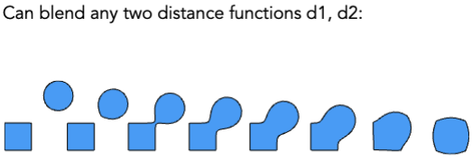
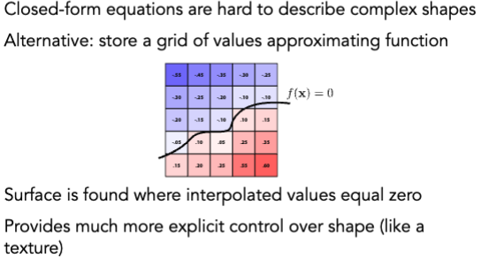

# Geometry 1

## Introduction to Geometry

### 隐式表达 (implicit representation)

#### Pros

- 紧凑的描述（例如，一个函数）
- 某些查询很容易（内部对象，到表面的距离）
- 适用于光线与表面的相交（稍后详述）
- 对于简单的形状，准确的描述/无抽样误差
- 易于处理拓扑变化（例如流体）

#### Cons

- 难以对复杂形状建模

### 显式表达 (explicit representation)

- point cloud
- polygon mesh
- subdivision, NURBS

## Distance Functions

## Level Set Methods (水平集方法)

