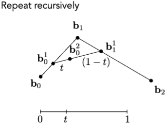
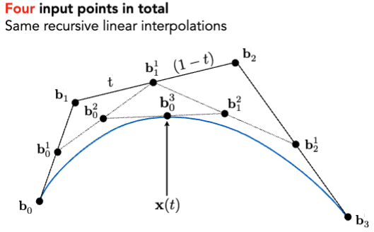
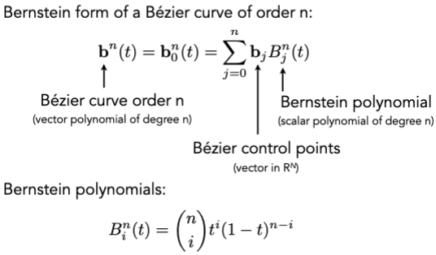
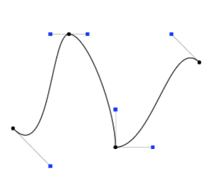

# Geometry 2

## Curve

### Bezier Curve

#### De Casteljau Algorithm

给定3个点，可以画出一条二阶贝塞尔曲线，给定4个点，可以画出一条三阶贝塞尔曲线，给定n个点，可以画出一条n-1阶贝塞尔曲线。

#### Algebraic Formula

$$ b^n(t) = \sum_{j=0}^n b_j B^n_j(t) $$

### Properties of Bezier Curve

- Interpolates endpoints
- Tangent to end segments
- Affine transformation property (仿射变换性质)
- Convex hull property (凸包性质)

### Piecewise Bezier Curve (分段贝塞尔曲线)

通常用每4个控制点作为一段，即每段为三阶贝塞尔曲线。

Q: 如何保证中间的某个点光滑过渡？  
A: 用两个三阶贝塞尔曲线拼接，控制点共线且距离一样方向相反。

## Surfaces

### Mesh Operations

- Mesh subdivision
- Mesh simplification
- Mesh regularization
