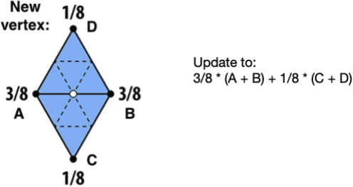
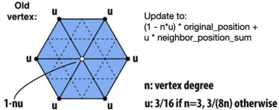
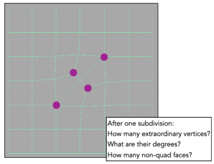
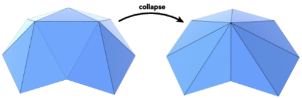
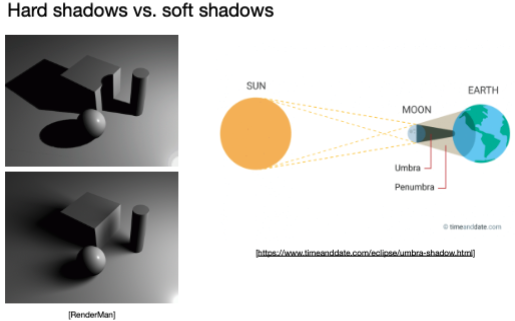

# Geometry 3

## Mesh Subdivision

### Loop Subdivision

For new vertices

For old vertices

### Catmull-Clark Subdivision

Degree 是顶点的度数，即与该顶点相连的边的条数。

Extraordinary vertex (奇异点) (degree != 4)

- 可用于任意多边形的细分。

## Mesh Simplification

### Edge Collapse

#### Quadric Error Metrics

- approximate distance to surface as sum of distances to planes containing triangles
- iteratively collapse edge with smallest score
- greedy algorithm

## Shadow Mapping

处理点光源

### 存在的问题

- Hard shadows (point lights only)
- Quality depends on shadow map resolution (general problem with image-based techniques)
- Involves equality comparison of floating point depth values means issues of scale, bias, tolerance

