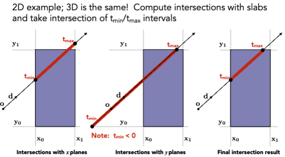

# Ray Tracing 1

> Whitted-Style Ray Tracing

## Ray Casting

## Recursive Ray Tracing

## Ray-Surface Intersection

定义一条光线 $r(t) = o + td$，$ 0 \leq t \leq \infty$，其中 $o$ 为光线起点，$d$ 为光线方向，$t$ 为光线长度。

### Ray Intersection with Sphere

Ray $r(t) = o + td, 0 \leq t \leq \infty$

Sphere $ p: (p - c)^2 - R^2 = 0$

Solve for intersection:

$ (o + td - c)^2 - R^2 = 0$

对于显式表面，可以直接求解 $t$，对于隐式表面，需要求解 $t$ 的根。

### Ray Intersection with Triangle Mesh

每个像素对应一条光线，每条光线与三角形网格相交，得到交点，计算交点的颜色。

Triangle is in a plane:

- Ray-plane intersection
- Test if hit point is inside triangle

定义平面：

法向量和平面上的一个点

Plane Equation:

$$ P: (p - p') \cdot N = 0 $$
p: all points on the plane, p': a point on the plane, N: normal vector of the plane

$$ ax + by + cz + d = 0 $$

#### Moller-Trumbore Algorithm

一个更快的方法，直接给出重心坐标。

$$ \vec{O} + t\vec{D} = (1 - b_1 - b_2)\vec{P_0} + b_1\vec{P_1} + b_2\vec{P_2} $$

$\vec{O} + t\vec{D}$ 与三角形的交点，可以用重心坐标表示。$ b_1, b_2 \in [0, 1]$，$ b_1 + b_2 \leq 1$ 表示重心坐标。

## Accelerating Ray-Surface Intersection

### Bounding Volumes

Box is the intersection of 3 pairs of slabs.

### Ray Intersection with Axis-Aligned Bounding Box

计算出 $t$ 的范围。

For 3D box:

$$ t_{enter} = max(t_{min})$$
$$ t_{exit} = min(t_{max})$$

如果 $t_{enter} \lt t_{exit}$，则光线与包围盒相交。

- What if $t_{exit} \lt 0$?
    - The box is “behind” the ray — no intersection!
- What if $t_{exit} \geq 0$ and $t_{enter} \lt 0$?
    - The ray’s origin is inside the box — have intersection!
- In summary, ray and AABB intersect iff
    - $t_{enter} \lt t_{exit}$ && $t_{exit} \geq 0 $

只看轴对齐的包围盒，可以快速判断是否相交。减少了很多计算。
