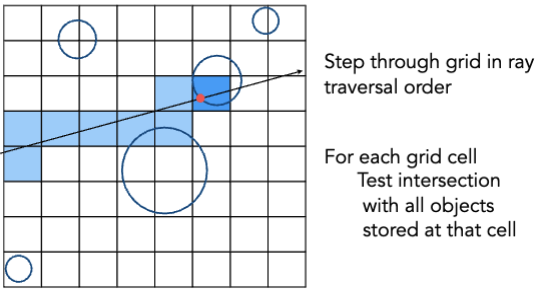
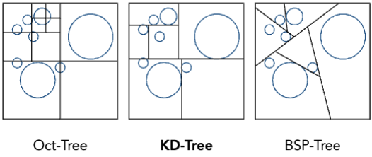
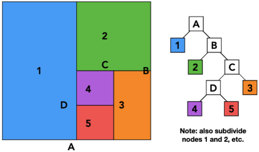
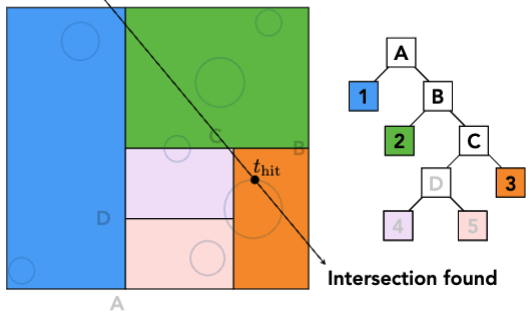
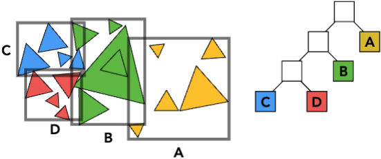
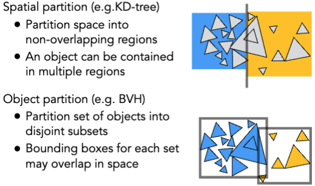
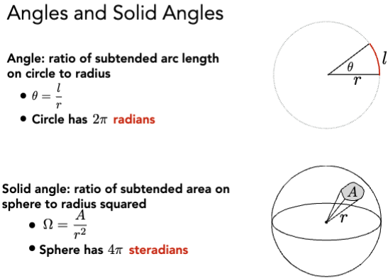
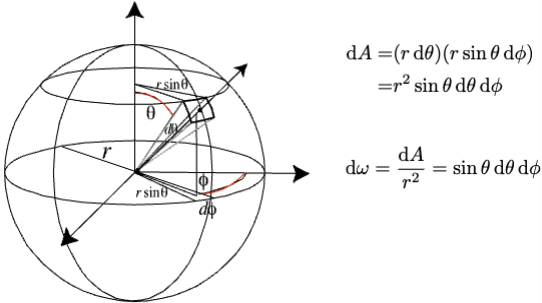
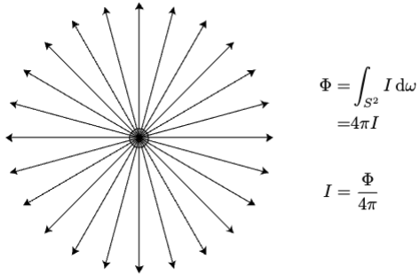

# Ray Tracing 2

> Accelerate Ray Tracing

## Uniform Grids

## Spatial Partitions

### Octrees

平面中看起来是一个正方形，但是在三维空间中看起来是一个立方体。所以切成了八个子空间。

### BSP Trees

选择一个平面，然后根据平面将空间分成两个部分，以此类推。

### KD-Trees

先沿着某个轴切，然后再沿着另一个轴切。

Internal nodes store

- split axis: x-, y-, or z-axis
- split position: coordinate of split plane along axis
- children: pointers to child nodes
- No objects are stored in internal nodes

Leaf nodes store

- list of objects

## Bounding Volume Hierarchy (BVH)

一个物体只可能在一个叶子节点中。

- Find bounding box
- Recursively split set of objects in two subsets
- Recompute the bounding box of the subsets
- Stop when necessary
- Store objects in each leaf
node

How to subdivide a node?

- Choose a dimension to split
- Heuristic #1: Always choose the longest axis in node
- Heuristic #2: Split node at location of **median** object

> 如果场景物体运动，BVH 需要重新构建。

这里会用到一个快速选择算法 (QuickSelection)

快速排序算法基于快排的思想衍生，其可以使某些需要 `O(nlogn)` 时间复杂度的问题，在平均复杂度 `O(n)` 下完成。常见的例子是求数组的第 k 小的数，运用快速选择算法的基本流程如下：

- 首先选定一个轴心值 `p`。
- 将数组中小于 `p` 的值移到数组左端，其他移动到数组右端。
- 计算轴心左端的数 (包括轴心自己) 有多少，记为 `count`
- 如果 `count` 正好为 `k`，则返回此时轴心值，此值即为第 `k` 小的数。
- 如果左端的数 `count` 大于 `k`，说明在左端，所以只递归左边即可。
- 如果不在左端，只递归在右边寻找。

与前面的快排几乎一样，只在后面有所不同，当完成分半以后，计算左边有多少个数记为 `pk`，如果其值正好为 `k`，则所求数已经找到，直接返回所求数，如果大于 `k` 则在左边寻找，否则在右边寻找。

算法可以的到平均复杂度 `O(n)`。

### Spatial vs Object Partitions

## Basic radiometry (辐射度量学)

New terms: Radiant flux, intensity, irradiance, radiance

### Radiant Energy and Flux

Radiant Energy:
$$ Q  [J = Joule] $$

Radiant Flux (power, 辐射通量):
$$ \Phi \equiv \frac{dQ}{dt} $$
$$ [W = Watt] [lm = lumen（流明）] $$

### Radiant Intensity (辐射强度)

$$ I(\omega) \equiv \frac{d\Phi}{d\omega} $$
$$ [\frac{W}{sr}] [\frac{lm}{sr} = cd = candela] $$

#### Angles and Solid Angles

Sphere: $ S^2 $

$$ \Omega = 4\pi $$

### Isotropic Point Source

结合生活中的例子：

