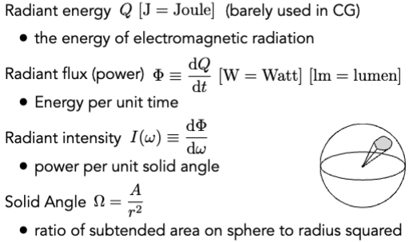
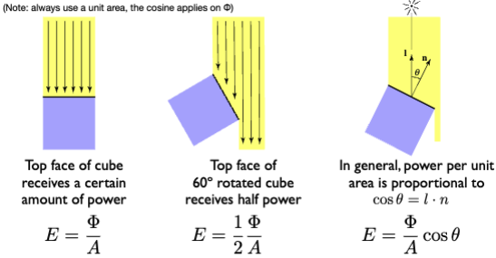
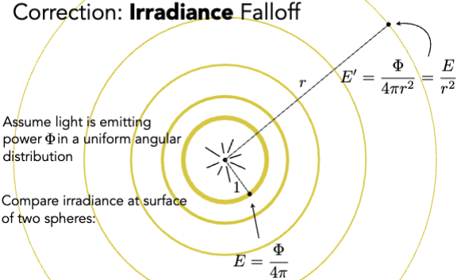
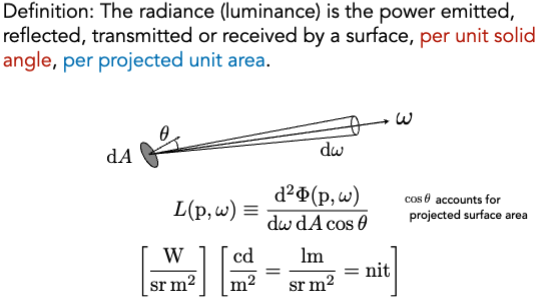
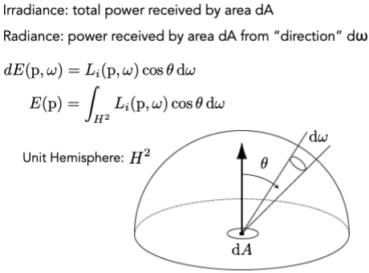
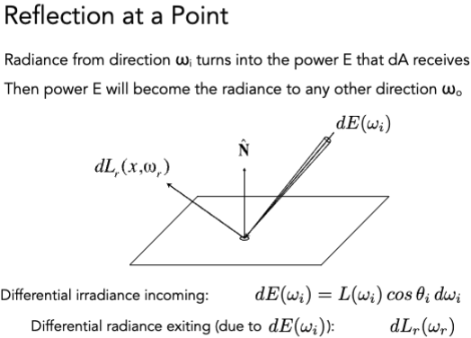
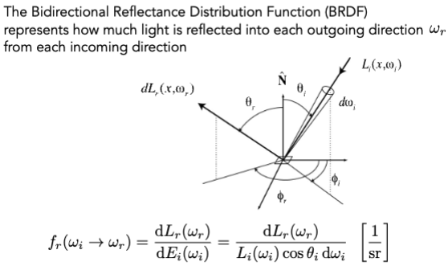
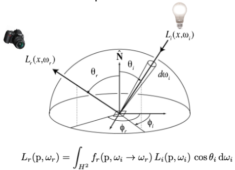
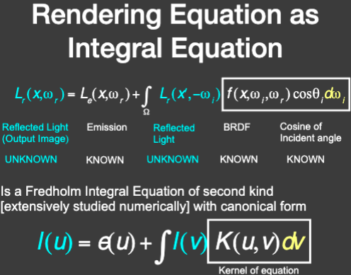
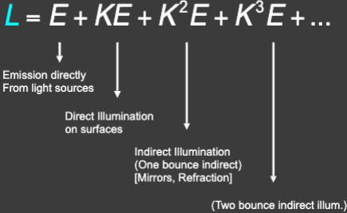

# Ray Tracing 3

> Radiometry (辐射度量学)

## Irradiance (辐照度)

每个单位面积上的能量

$$ E \equiv \frac{d\Phi(x)}{dA} $$

$$ [\frac{W}{m^2}] [\frac{lm}{m^2} = lux] $$

### Lambert’s Cosine Law

## Radiance (辐射度)

辐射度（亮度）是指一个表面在单位实体角度、单位投影面积上发出、反射、传输或接收的功率。

## Irradiance vs. Radiance

Irradiance: 单位面积上接受的所有能量。
Radiance: 从某个方向上接受的所有能量。

## Bidirectional Reflectance Distribution Function (BRDF)

光线从表面入射，被物体表面吸收、反射然后离开的过程。

这就意味着，对于不同材质的物体，我们需要不同的 BRDF。

## Rendering Equation

$$ L_o(p, \omega_o) = L_e(p, \omega_o) + \int_{\Omega^+} L_i(p, \omega_i) f_r(p, \omega_i, \omega_o)(n \cdot \omega_i) d\omega_i $$

简化成：

$$ L = E + KL $$

$$ L = (I-K)^{-1} E $$

$$ L = (I + K + K^2 + K^3 + ...)E $$
$$ L = E + KE + K^2E + K^3E + ... $$

## Probability Review

### Expected Value

$$ E[X] = \sum_{i=1}^n x_i p_i $$

Die example:

$$ E[X] = \sum_{i=1}^6 x_i p_i = 1 \times \frac{1}{6} + 2 \times \frac{1}{6} + 3 \times \frac{1}{6} + 4 \times \frac{1}{6} + 5 \times \frac{1}{6} + 6 \times \frac{1}{6} = \frac{21}{6} = 3.5 $$

### PDF (Probability Distribution Function)

Conditions on p(x):

$$ p(x) \geq 0$$
And
$$\int p(x) dx = 1 $$

Expected value of X:

$$ E[X] = \int x p(x) dx $$

### Function of Random Variable

$$ X \sim p(x) $$

$$ Y = f(X) $$

$$ E[Y] = E[f(X)] = \int f(x) p(x) dx $$
