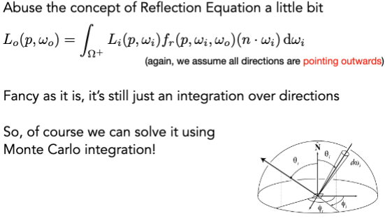
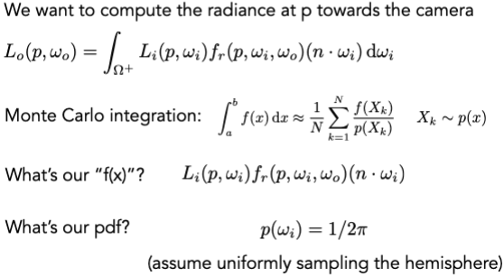
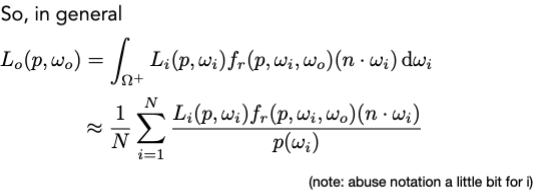
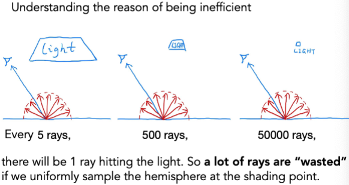
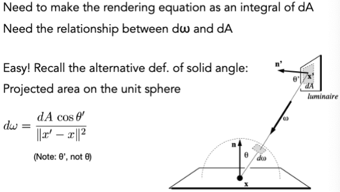
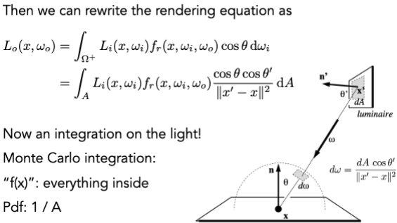
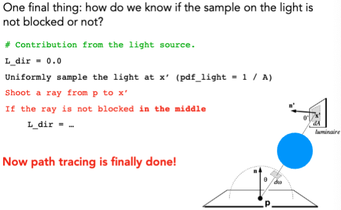
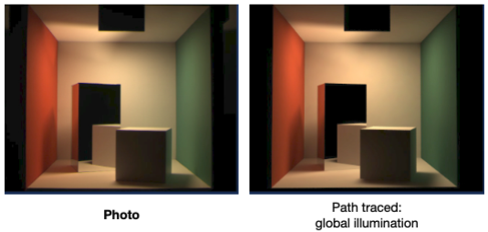

# Ray Tracing 4

## Monte Carlo Integration

$$ \int f(x) dx = \frac{1}{N} \sum_{i=1}^N \frac{f(X_i)}{p(X_i)} $$

$$ X_i \sim p(X_i) $$

Some notes:

- The more samples, the less variance.
- Sample on x, integrate on x.

N 是样本数量，p 是概率密度函数，X 是样本。在积分域上均匀的取样，然后计算积分。

## Path Tracing

### A Simple Monte Carlo Solution



算半球上的积分




图片中$p$是点，$p(\omega_i)$是点p的方向的概率密度函数。

Code (direct lighting):

```cpp
shade(p, wo)
    Randomly choose N directions wi~pdf
    Lo = 0.0
    For each wi
        Trace a ray r(p, wi)
        If ray r hit the light
            Lo += (1 / N) * L_i * f_r * cosine / pdf(wi)
    Return Lo
```

为了减少计算量，只考虑一个方向的积分。

Code of Global Illumination:

```cpp
shade(p, wo)
    Randomly choose ONE direction wi~pdf(w)
    Trace a ray r(p, wi)
    If ray r hit the light
        Return L_i * f_r * cosine / pdf(wi)
    Else If ray r hit an object at q
        Return shade(q, -wi) * f_r * cosine / pdf(wi)
```

### Ray Generation

Code:

```cpp
ray_generation(camPos, pixel)
    Uniformly choose N sample positions within the pixel
    pixel_radiance = 0.0
    For each sample in the pixel
        Shoot a ray r(camPos, cam_to_sample)
        If ray r hit the scene at p
            pixel_radiance += 1 / N * shade(p, sample_to_cam)
    Return pixel_radiance
```

### Russian Roulette（轮盘赌）

设定一个概率，如果小于这个概率，就继续追踪，否则就停止。

Expect:

$$ E = P * (\frac{Lo}{P}) + (1 - P) * 0 = Lo $$

Code:

```cpp

shade(p, wo)
    Manually specify a probability P_RR
    Randomly select ksi in a uniform dist. in [0, 1]
    If (ksi > P_RR) return 0.0;

    Randomly choose ONE direction wi~pdf(w)
    Trace a ray r(p, wi)
    If ray r hit the light
        Return L_i * f_r * cosine / pdf(wi) / P_RR
    Else If ray r hit an object at q
        Return shade(q, -wi) * f_r * cosine / pdf(wi) / P_RR
```

存在的问题：







### Rendering Equation

$$ L_o(x, \omega_o) = \int_{A} L_i(x, \omega_i) f_r(x, \omega_i, \omega_o) \frac{\cos \theta \cos \theta'}{||x' - x||^2} dA $$

Code:

```cpp
shade(p, wo)
    # Contribution from the light source.
    Uniformly sample the light at x’ (pdf_light = 1 / A)
    L_dir = L_i * f_r * cos θ * cos θ’ / |x’ - p|^2 / pdf_light
    # Contribution from other reflectors.
    L_indir = 0.0
    Test Russian Roulette with probability P_RR
    Uniformly sample the hemisphere toward wi (pdf_hemi = 1 / 2pi)
    Trace a ray r(p, wi)
    If ray r hit a non-emitting object at q
        L_indir = shade(q, -wi) * f_r * cos θ / pdf_hemi / P_RR
    Return L_dir + L_indir
```

考虑特殊情况：


### Photo-realistic Rendering


