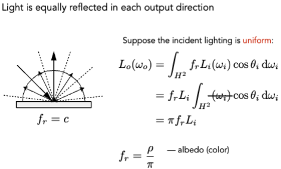
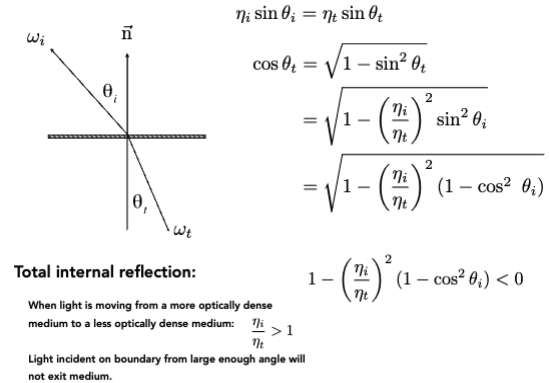
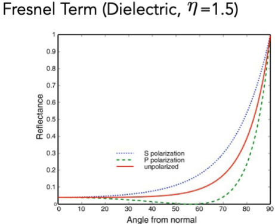
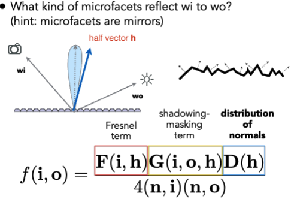
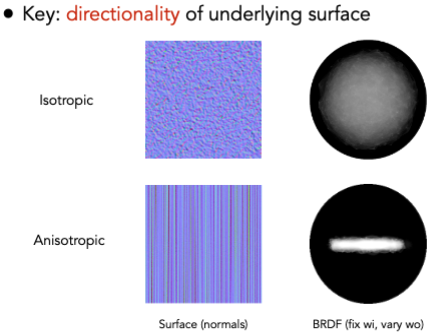
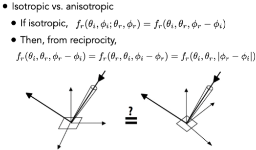

# Materials and Appearances

## Material == BRDF

* Material: a surface property that determines how light interacts with the surface

### Diffuse / Lambertian Material

### Glossy Material (BRDF)

### Ideal reflective / reflective material (BSDF*)

### Specular Refraction

#### Law of Refraction

全反射现象

### Fresnel Reflection / Term (菲涅耳项)

$$ R_{eff} = \frac{1}{2}(R_s + R_p) $$

Approximate: Schlick’s approximation

$$ R(\theta) = R_0 + (1 - R_0)(1 - \cos \theta)^5 $$

$$ R_0 = \frac{(n_1 - n_2)^2}{(n_1 + n_2)^2} $$

### Microfacet Theory

### Isotropic / Anisotropic Material (BRDFs)

Properties of BRDFs
- Non-negative
- Linearity
- Reciprocity principle
- Energy conservation

