# Advanced Topics in Rendering

## Advanced Light Transport

### Bidirectional Path Tracing (BDPT)

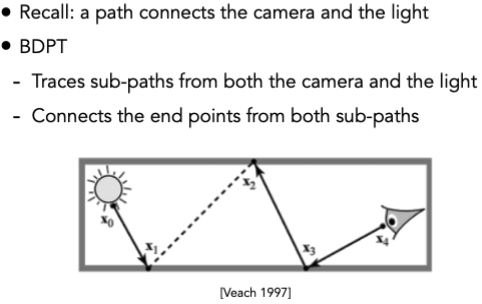

### Metropolis Light Transport (MLT)

利用马尔科夫链蒙特卡洛方法，对光线传输进行采样。预测下一个采样点的位置，然后利用Metropolis-Hastings算法接受或拒绝这个采样点。

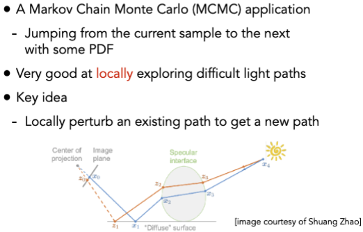

### Photon Mapping

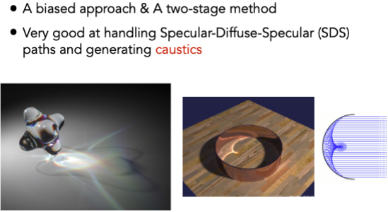

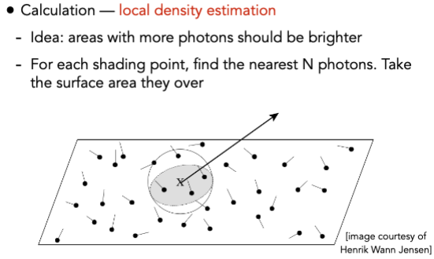

## Advanced Appearance Modeling

### Participating Media

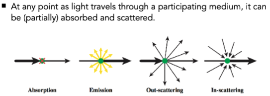

### Hair Appearance

### Marschner Model

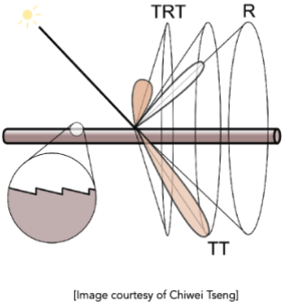

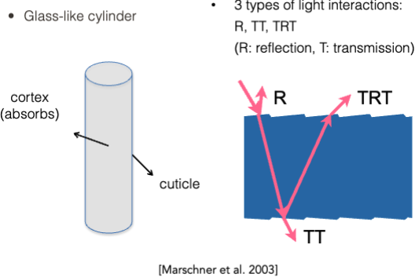

### Human Hair vs. Animal Fur

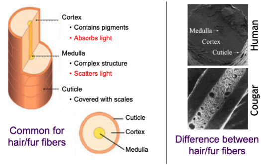

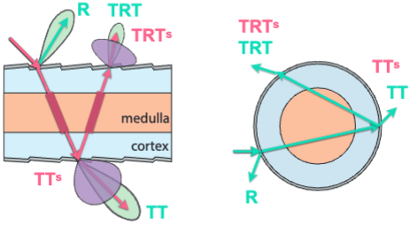

### Granular Material

颗粒材质，如沙子、石头等。

## Surface Models

### Dipole Approximation

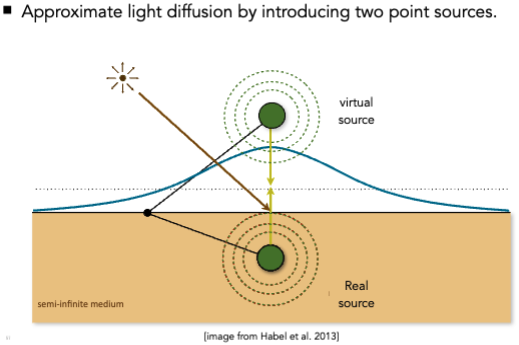

### Cloth

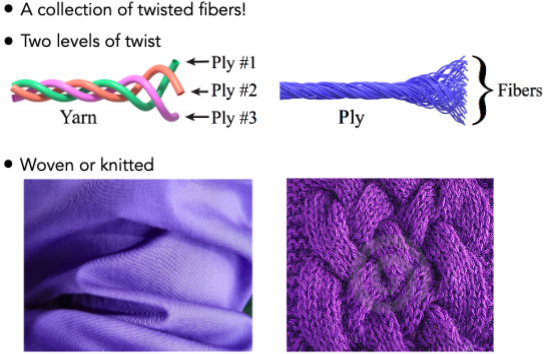

