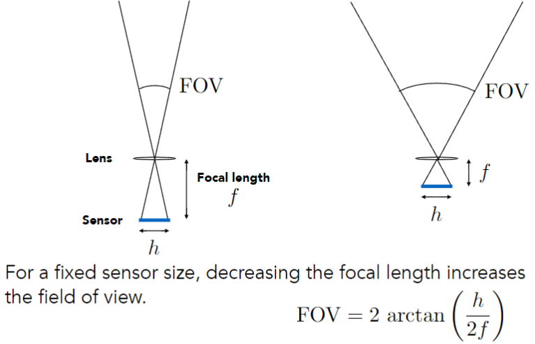
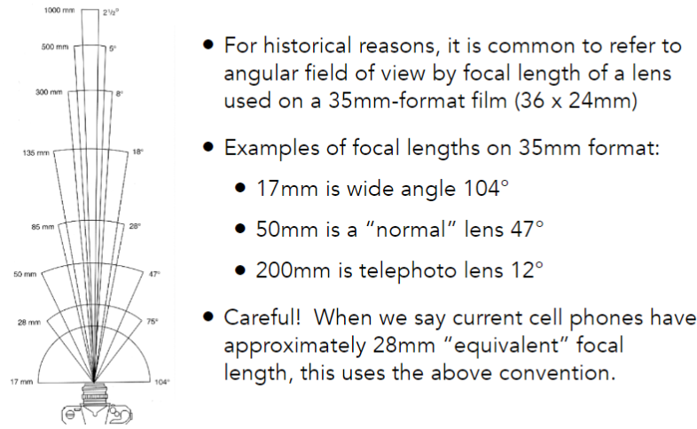

# Cameras, Lenses and Light Fields

## Field of View (FOV, 视场)

### Effect of Focal Length on FOV

### Focal Length v. Field of View

## Exposure (曝光)

- H = T x E
- Exposure = time x irradiance (曝光 = 时间 x 辐照度)
- Exposure time (T)
    - Controlled by shutter
- Irradiance (E)
    - Power of light falling on a unit area of sensor
    - Controlled by lens aperture and focal length (由光圈和焦距控制)
