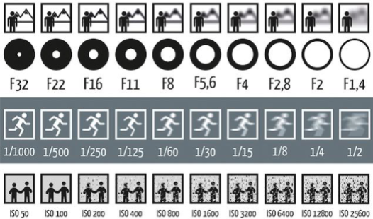
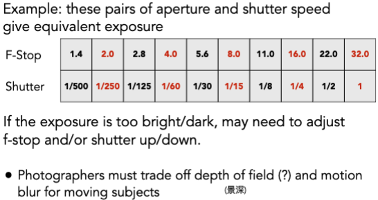
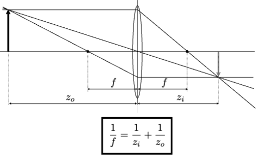
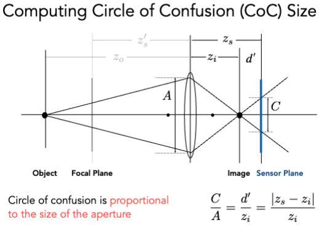
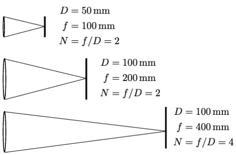
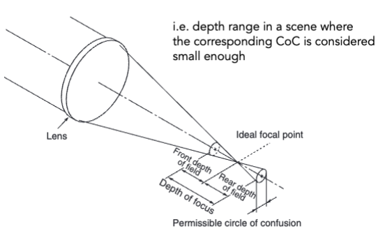
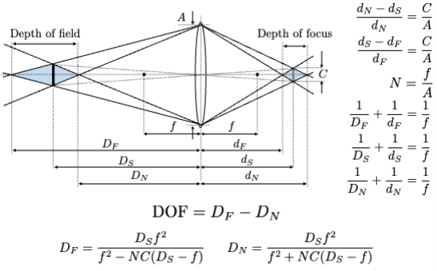

# Cameras, Lenses and Light Fields

## Field of View (FOV, 视场)

### Effect of Focal Length on FOV

### Focal Length v. Field of View

## Exposure (曝光)

- H = T x E
- Exposure = time x irradiance (曝光 = 时间 x 辐照度)
- Exposure time (T)
    - Controlled by shutter
- Irradiance (E)
    - Power of light falling on a unit area of sensor
    - Controlled by lens aperture and focal length (由光圈和焦距控制)

- Aperture (光圈) size
    - Change the f-stop by opening / closing the aperture (if camera has iris control)
- Shutter speed (快门速度)
    - Change the duration the sensor pixels integrate light
- ISO gain (感光度, ISO增益)
    - Change the amplification (analog and/or digital) between sensor values and digital image values

## Exposure: Aperture, Shutter, Gain (ISO)

### ISO (Gain)

Third variable for exposure

Film: trade sensitivity for grain

Digital: trade sensitivity for noise

- Multiply signal before analog-to-digital conversion
- Linear effect (ISO 200 needs half the light as ISO 100)

### F-Stop (光圈)

Written as FN or F/N. N is the f-number.

Informal understanding: the inverse-diameter of a round aperture (圆孔径的倒数)

### Shutter Speed (快门速度)

运动模糊可以达到一定的反走样的效果。

Rolling shutter: different parts of photo taken at different times

### F-Stop vs. Shutter Speed

### Fast and Slow Photography

#### High Speed Photography

Normal exposure = extremely fast shutter speed x (large aperture and/or high ISO)

快门速度 + 大光圈 + 高ISO（尽量不用）

#### Long Exposure Photography

Normal exposure = extremely slow shutter speed x (small aperture and/or low ISO)

小光圈 + 低ISO + 长时间

## Thin Lens Approximation

### The Thin Lens Equation

### Defocus Blur (失焦模糊)

用小光圈拍的越清楚。

### Depth of Field (景深)

光圈越小，景深越大（清晰范围越大）。

#### DOF Online Demo

http://graphics.stanford.edu/courses/cs178/applets/dof.html
