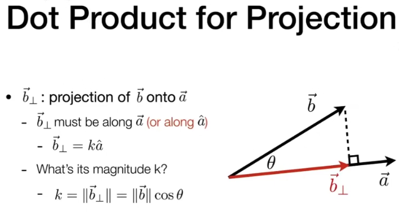
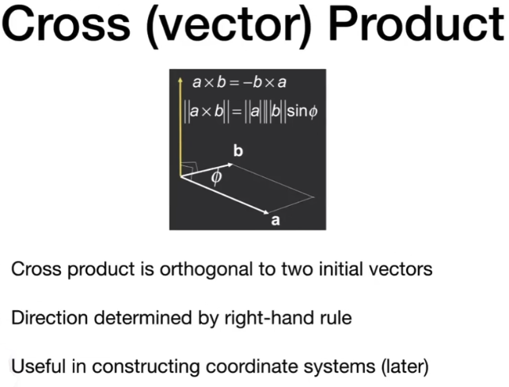

# Review of Linear Algebra

## Vectors

$\vec{AB} = B - A$

Length of a vector: $\lVert \vec{AB} \rVert = \sqrt{(B_x - A_x)^2 + (B_y - A_y)^2}$

Unit vector: $\hat{a} = \frac{\vec{a}}{\lVert \vec{a} \rVert}$

### Vector Addition

$\vec{a} + \vec{b} = \begin{bmatrix} a_x \\ a_y \end{bmatrix} + \begin{bmatrix} b_x \\ b_y \end{bmatrix} = \begin{bmatrix} a_x + b_x \\ a_y + b_y \end{bmatrix}$

通常以列向量的形式表示向量，所以向量加法的结果也是列向量。

### Vector Multiplication

#### Dot(Scalar) Product

$\vec{a} \cdot \vec{b} = ||\vec{a}|| ||\vec{b}|| \cos \theta$

$cos \theta = \frac{\vec{a} \cdot \vec{b}}{||\vec{a}|| ||\vec{b}||}$

For Unit Vectors: $\vec{a} \cdot \vec{b} = \hat{a} \cdot \hat{b} = \cos \theta$

#### Dot Product Properties

$\vec{a} \cdot \vec{b} = \vec{b} \cdot \vec{a}$

$\vec{a} \cdot (\vec{b} + \vec{c}) = \vec{a} \cdot \vec{b} + \vec{a} \cdot \vec{c}$

$(k\vec{a}) \cdot \vec{b} = \vec{a} \cdot (k\vec{b}) = k(\vec{a} \cdot \vec{b})$

In 2D:

$\vec{a} \cdot \vec{b} = \begin{bmatrix} x_a \\ y_a \end{bmatrix} \cdot \begin{bmatrix} x_b \\ y_b \end{bmatrix} = x_a x_b + y_a y_b$

In 3D:

$\vec{a} \cdot \vec{b} = \begin{bmatrix} x_a \\ y_a \\ z_a \end{bmatrix} \cdot \begin{bmatrix} x_b \\ y_b \\ z_b \end{bmatrix} = x_a x_b + y_a y_b + z_a z_b$

### 求投影

### Cross Product (叉乘)

* 遵循右手螺旋定则，即手指从 $\vec{a}$ 指向（旋转向） $\vec{b}$，手指的方向就是 $\vec{a} \times \vec{b}$ 的方向。
* 叉乘得到的向量垂直于 $\vec{a}$ 和 $\vec{b}$。
* 叉乘的结果是一个向量，长度为 $\vec{a}$ 和 $\vec{b}$ 的长度的乘积与它们的夹角的正弦值的乘积。

For example:

$$\vec{x} \times \vec{y} = +\vec{z}$$
$$\vec{y} \times \vec{x} = -\vec{z}$$
$$\vec{y} \times \vec{z} = +\vec{x}$$
$$\vec{z} \times \vec{y} = -\vec{x}$$
$$\vec{z} \times \vec{x} = +\vec{y}$$
$$\vec{x} \times \vec{z} = -\vec{y}$$

#### Cross Product Properties

$$\vec{a} \times \vec{b} = -\vec{b} \times \vec{a}$$
$$\vec{a} \times \vec{a} = \vec{0}$$
$$\vec{a} \times (\vec{b} + \vec{c}) = \vec{a} \times \vec{b} + \vec{a} \times \vec{c}$$
$$\vec{a} \times (k\vec{b}) = k(\vec{a} \times \vec{b})$$

In 3D:

$$\vec{a} \times \vec{b} = \begin{bmatrix} x_a \\ y_a \\ z_a \end{bmatrix} \times \begin{bmatrix} x_b \\ y_b \\ z_b \end{bmatrix} = \begin{bmatrix} y_a z_b - z_a y_b \\ z_a x_b - x_a z_b \\ x_a y_b - y_a x_b \end{bmatrix}$$

### Transpose of a Matrix

$$\begin{bmatrix} 1 & 2 \\ 3 & 4 \\ 5 & 6 \end{bmatrix}^T = \begin{bmatrix} 1 & 3 & 5 \\ 2 & 4 & 6 \end{bmatrix}$$

#### properties

$$(AB)^T = B^T A^T$$

### Identity Matrix and Inverse Matrix

$ I = \begin{bmatrix} 1 & 0 \\ 0 & 1 \end{bmatrix}$

$ AA^{-1} = A^{-1}A = I $

$ (AB)^{-1} = B^{-1}A^{-1} $

### Vector Multiplication in Matrix form

#### Dot Product

$$\vec{a} \cdot \vec{b} = \vec{a}^T \vec{b} = (x_a y_a z_a) \cdot \begin{bmatrix} x_b \\ y_b \\ z_b \end{bmatrix} = (x_a x_b + y_a y_b + z_a z_b)$$
