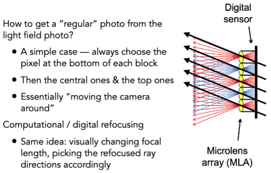
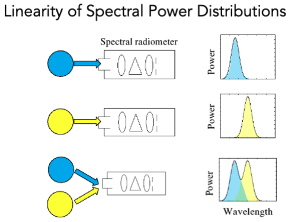
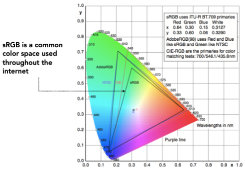
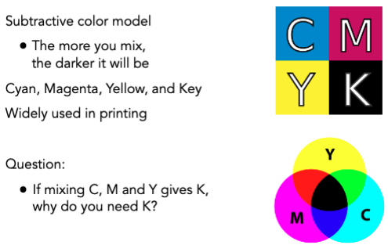

# Color and Perception

## Light Field（光场）/ Lumigraph

### The Plenoptic Function（全光函数）

$$ \mathcal{P}(\theta, \phi, \lambda, t, V_x, V_y, V_z) $$

### Plenoptic Surface （全光面）

## Light Field Camera

## Physical Basis of Color

### Spectral Power Distribution (SPD, 光谱功率分布)

## Metamers (同色异形)

Metamers are two different spectra (∞-dim) that project to the same (S,M,L) (3-dim) response.

- These will appear to have the same color to a human

The existence of metamers is critical to color reproduction

- Don’t have to reproduce the full spectrum of a real world scene
- Example: A metamer can reproduce the perceived color of a real-world scene on a display with pixels of only three
colors

## Color Spaces

- Standardized RGB
- CIE XYZ
    - Y is luminance(亮度)

### Gamut (色域)

### Perceptually Organized Color Spaces

- HSV
    - Hue(色相)
    - Saturation(饱和度)
    - Value(明度)

- CIELAB (CIE L\*a\*b\*)
    - L is luminance(亮度)
    - a and b are chromaticity(色度)

### CMYK (Cyan, Magenta, Yellow, Black)

Anwser: Black ink is cheaper than cyan ink.
