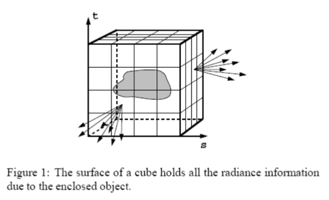
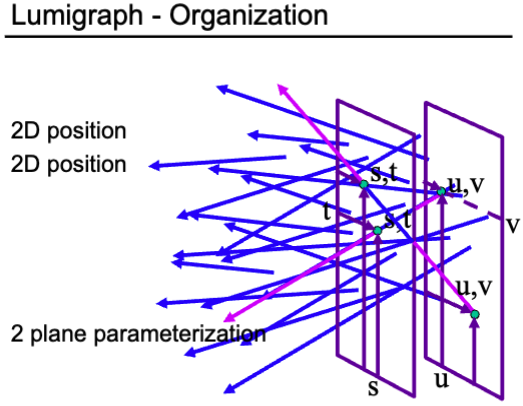

# Color and Perception

## Light Field（光场）/ Lumigraph

### The Plenoptic Function（全光函数）

$$ \mathcal{P}(\theta, \phi, \lambda, t, V_x, V_y, V_z) $$

### Plenoptic Surface （全光面）

## Light Field Camera

