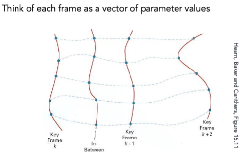
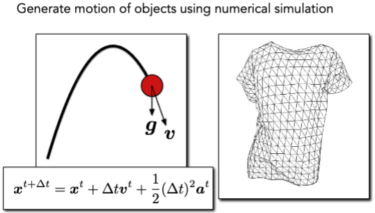
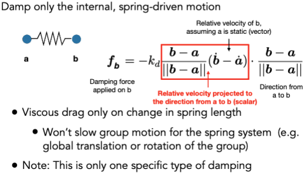
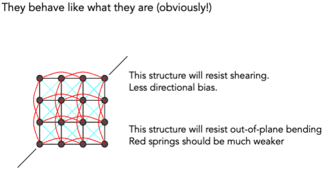
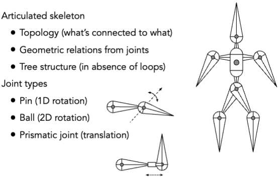
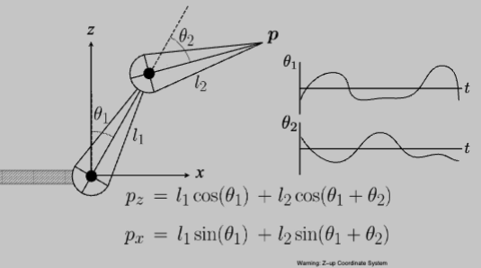
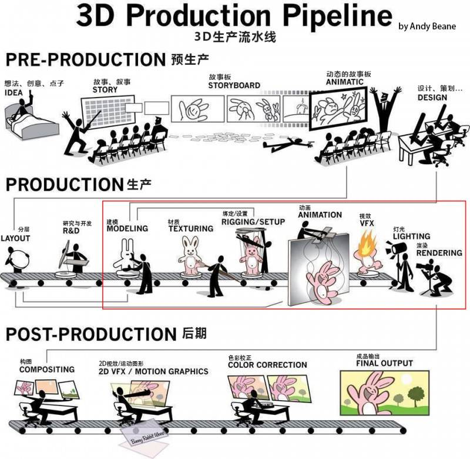

# Animation

- Film: 24 frames per second
- Video (in general): 30 fps
- Virtual reality (VR): 90 fps

## Keyframe Animation

### Keyframe Interpolation

## Physical Simulation

### Newton’s Law

$$ F = ma $$

衣服各顶点可以用一个速度和加速度来表示。

### Mass Spring System (质点弹簧系统)

- Mass Spring Rope
- Hair
- Mass Spring Mesh (Cloth)

### Internal Damping for Spring (弹簧内阻尼)

$ x $ 位置向量

$ \dot{x} = v $ 速度向量

$ \ddot{x} = a $ 加速度向量

### Particle Systems

Attraction and repulsion forces

- Gravity, electromagnetism, ...
- Springs, propulsion, ...

Damping forces

- Friction, air drag, viscosity, ...

Collisions

- Walls, containers, fixed objects, ...
- Dynamic objects, character body parts, ...

## Kinematics (运动学)

### Forward Kinematics (正运动学)

### Inverse Kinematics (逆运动学)

Numerical solution to general N-link IK problem

- Choose an initial configuration
- Define an error metric (e.g. square of distance between goal and current position)
- Compute gradient of error as function of configuration
- Apply gradient descent (or Newton’s method, or other optimization procedure)

## Rigging

### Blend Shapes

控制点插值

### Motion Capture (动作捕捉)

Strengths

- Can capture large amounts of real data quickly
- Realism can be high

Weaknesses

- Complex and costly set-ups
- Captured animation may not meet artistic needs, requiring alterations

### The Production Pipeline

