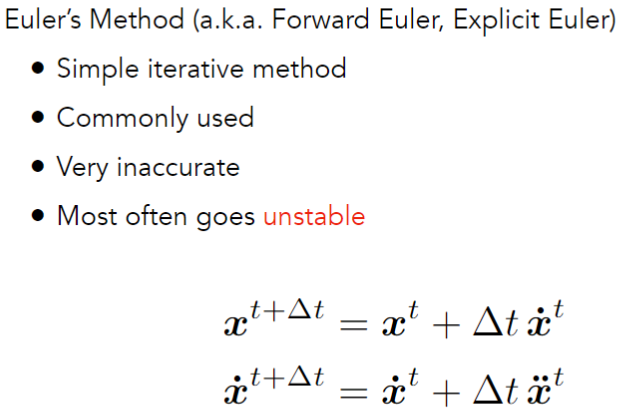
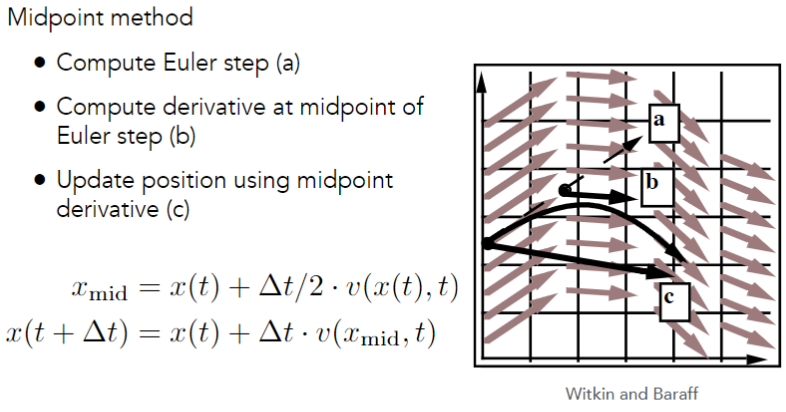
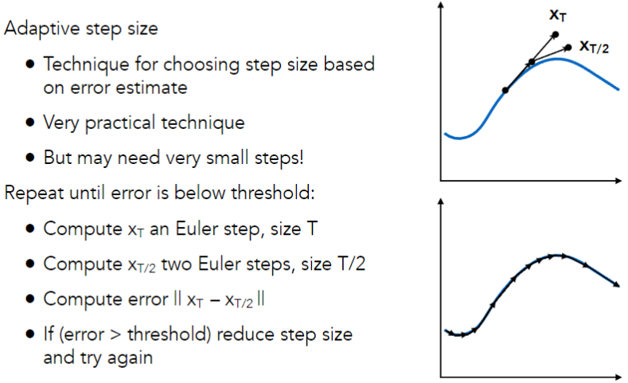
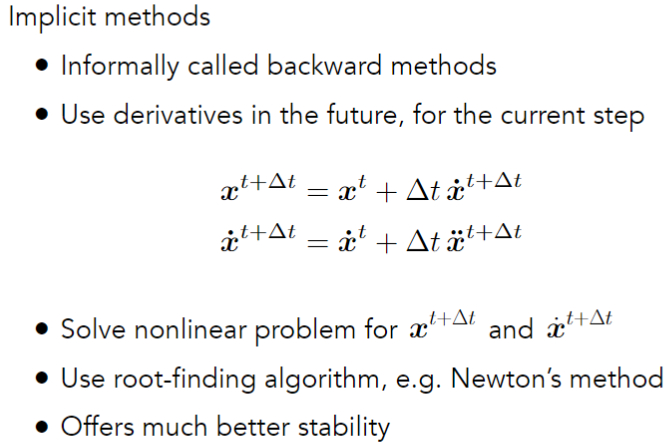
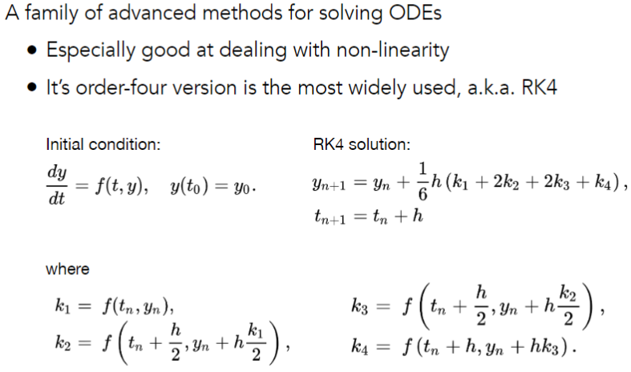
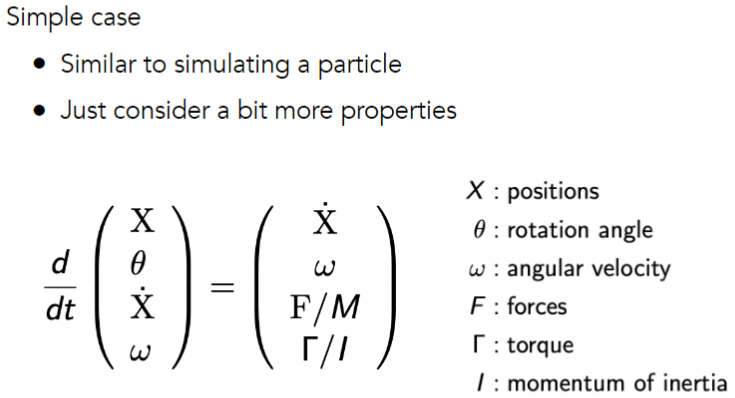
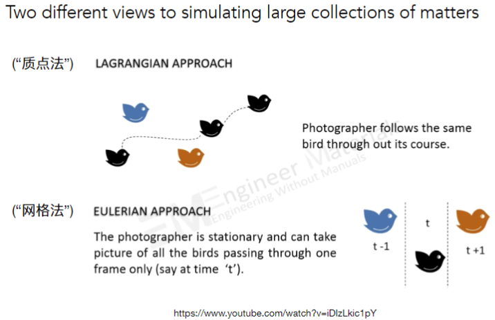
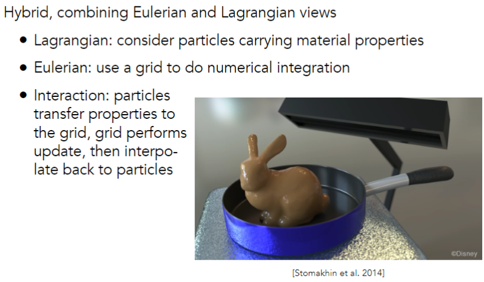

# Animation Cont.

## Single Particle Simulation

### Explicit Euler Method

Errors

- Errors at each time step accumulate. Accuracy decreases as simulation proceeds
- Accuracy may not be critical in graphics applications

Instability

- Errors can compound, causing the simulation to diverge even when the underlying system does not
- Lack of stability is a fundamental problem in simulation, and cannot be ignored

### Instability And Improvements

#### Midpoint Method

#### Adaptive Step Size

自适应的步长，可以根据误差来调整步长，使得误差控制在一个合理的范围内。

#### Implicit Euler Method

How to determine / quantize "stability"?

- We use the local truncation error (every step) / total accumulated error (overall)
- Absolute values do not matter, but the orders w.r.t. step
- Implicit Euler has order 1, which means that
    - Local truncation error: O(h2) and
    - Global truncation error: O(h) (h is the step, i.e. ∆t)
- Understanding of O(h)
    - If we halve h, we can expect the error to halve as well

#### Runge-Kutta Families

#### Position-Based / Verlet Integration

Idea:

- After modified Euler forward-step, constrain positions of particles to prevent divergent, unstable behavior
- Use constrained positions to calculate velocity
- Both of these ideas will dissipate energy, stabilize

Pros / cons

- Fast and simple
- Not physically based, dissipates energy (error)

## Rigid Body Simulation (刚体模拟)

## Fluid Simulation

### A Simple Position-Based Method

通过对粒子的位置进行约束，来模拟流体的运动。

模拟水花：密度变换时，通过移动粒子的位置来模拟。

### Eulerian vs. Lagrangian

### Material Point Method (MPM)

