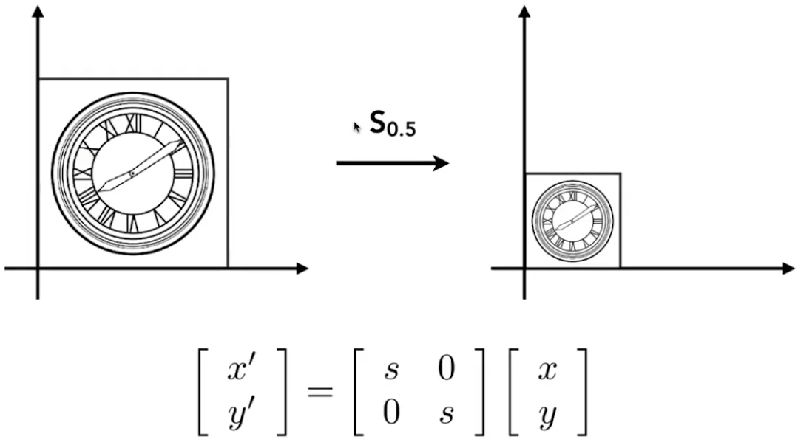
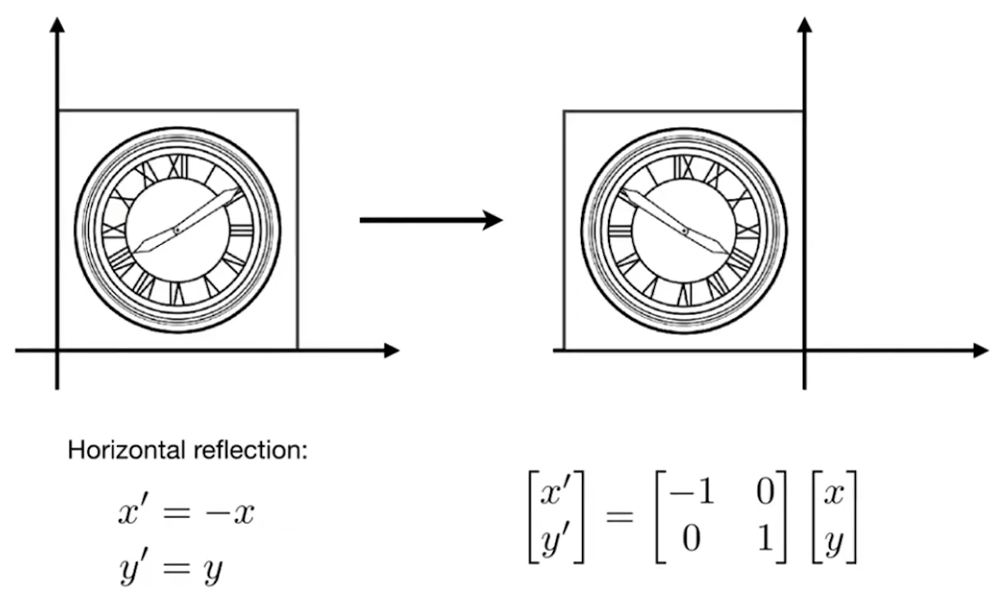
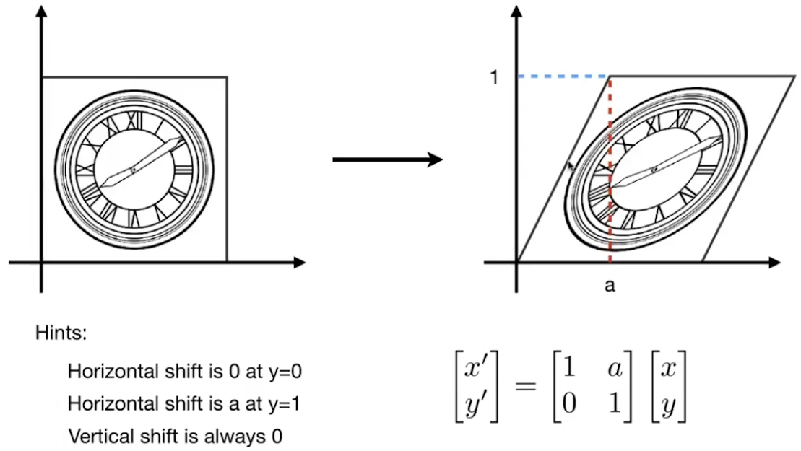
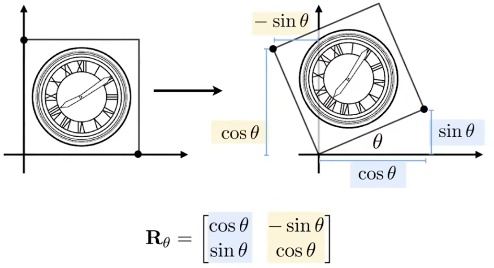

# Transformation

## Scale Matrix

Non-uniform scaling isalso possible by using a diagonal matrix.

## Reflection Matrix

## Shear Matrix

Tips:
$$ k = \frac{1}{a} $$
$$ y = \frac{1}{a}x $$
$$ x = ay $$

## Rotation Matrix

## Conslusion

For any Linear Transformation, we can find a matrix that represents it.

$$ x' = M x $$

## Homogeneous Coordinates

Add a third coordinate

* 2D poitn = $ (x, y, 1)^T $
* 2D vector = $ (x, y, 0)^T $

### Matrix representation of transformation

$$ \begin{bmatrix} x' \\ y' \\ w' \end{bmatrix} = \begin{bmatrix} 1 & 0 & t_x \\ 0 & 1 & t_y \\ 0 & 0 & 1 \end{bmatrix} \begin{bmatrix} x \\ y \\ 1 \end{bmatrix} = \begin{bmatrix} x + t_x \\ y + t_y \\ 1 \end{bmatrix} $$

* vector + vector = vector
* point - point = vector
* point + vector = point
* point + point = point(midpoint)

## Affine Transformation

Affine map = linear map + translation
$$ \begin{bmatrix} x' \\ y' \end{bmatrix} = \begin{bmatrix} a & b \\ c & d \end{bmatrix} \begin{bmatrix} x \\ y \end{bmatrix} + \begin{bmatrix} t_x \\ t_y \end{bmatrix} $$

Using Homogeneous Coordinates

$$ \begin{bmatrix} x' \\ y' \\ 1 \end{bmatrix} = \begin{bmatrix} a & b & t_x \\ c & d & t_y \\ 0 & 0 & 1 \end{bmatrix} \begin{bmatrix} x \\ y \\ 1 \end{bmatrix} $$

## 2D Transformation

### Scale

$$ S(s_x, s_y) = \begin{bmatrix} s_x & 0 & 0 \\ 0 & s_y & 0 \\ 0 & 0 & 1 \end{bmatrix} $$

### Rotation

$$ R(\theta) = \begin{bmatrix} \cos \theta & -\sin \theta & 0 \\ \sin \theta & \cos \theta & 0 \\ 0 & 0 & 1 \end{bmatrix} $$

### Translation

$$ T(t_x, t_y) = \begin{bmatrix} 1 & 0 & t_x \\ 0 & 1 & t_y \\ 0 & 0 & 1 \end{bmatrix} $$

## Transform Ordering Matters

Matrix multiplication is not commutative

$$ R(\theta) T(t_x, t_y) \neq T(t_x, t_y) R(\theta) $$

Note: Matrices are applied right to left

$$ T(1, 0) \cdot R(45) \begin{bmatrix} 1 \\ 0 \\ 1 \end{bmatrix} = \begin{bmatrix} 1 & 0 & 1 \\ 0 & 1 & 0 \\ 0 & 0 & 1 \end{bmatrix} \begin{bmatrix} \cos 45 & -\sin 45 & 0 \\ \sin 45 & \cos 45 & 0 \\ 0 & 0 & 1 \end{bmatrix} \begin{bmatrix} x \\ y \\ 1 \end{bmatrix} $$

Just like: $$T(R(M))$$

## 3D Transformations

Using Homogeneous Coordinates

* 3D point = $ (x, y, z, 1)^T $
* 3D vector = $ (x, y, z, 0)^T $

Use 4x4 matrix for affine transformation

$$ \begin{bmatrix} x' \\ y' \\ z' \\ 1 \end{bmatrix} = \begin{bmatrix} a & b & c & t_x \\ d & e & f & t_y \\ g & h & i & t_z \\ 0 & 0 & 0 & 1 \end{bmatrix} \begin{bmatrix} x \\ y \\ z \\ 1 \end{bmatrix} $$

Linear Transformation first, then translation
