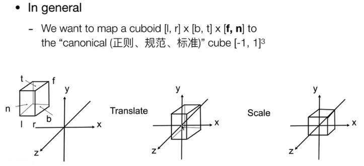

# Transformation Continued

## Rotation and its inverse Matrix

$ R_\theta = \begin{bmatrix} \cos \theta & -\sin \theta \\ \sin \theta & \cos \theta \end{bmatrix} $

$ R_{-\theta} = \begin{bmatrix} \cos \theta & \sin \theta \\ -\sin \theta & \cos \theta \end{bmatrix} = R_\theta^T $

By definition, $ R_{-\theta} = R_\theta^{-1} $

## 3D Transformations

### Scale

$ S(s_x, s_y, s_z) = \begin{bmatrix} s_x & 0 & 0 & 0 \\ 0 & s_y & 0 & 0 \\ 0 & 0 & s_z & 0 \\ 0 & 0 & 0 & 1 \end{bmatrix} $

### Translation

$ T(t_x, t_y, t_z) = \begin{bmatrix} 1 & 0 & 0 & t_x \\ 0 & 1 & 0 & t_y \\ 0 & 0 & 1 & t_z \\ 0 & 0 & 0 & 1 \end{bmatrix} $

## Rotation

### Rotation around X-axis

$ R_x(\theta) = \begin{bmatrix} 1 & 0 & 0 & 0 \\ 0 & \cos \theta & -\sin \theta & 0 \\ 0 & \sin \theta & \cos \theta & 0 \\ 0 & 0 & 0 & 1 \end{bmatrix} $

实际上可以看作旋转了y轴和z轴，但是x轴不变。

### Rotation around Y-axis

$ R_y(\theta) = \begin{bmatrix} \cos \theta & 0 & \sin \theta & 0 \\ 0 & 1 & 0 & 0 \\ -\sin \theta & 0 & \cos \theta & 0 \\ 0 & 0 & 0 & 1 \end{bmatrix} $

### Rotation around Z-axis

$ R_z(\theta) = \begin{bmatrix} \cos \theta & -\sin \theta & 0 & 0 \\ \sin \theta & \cos \theta & 0 & 0 \\ 0 & 0 & 1 & 0 \\ 0 & 0 & 0 & 1 \end{bmatrix} $

## 3D Rotations

### Application

飞机的旋转，可以看作是绕着三个轴旋转。

| Roll | Pitch | Yaw |
| ---- | ----- | --- |
| 滚转 | 俯仰 | 偏航 |

### Rodrigues' Rotation Formula

#### Rotation by angle $\alpha$ around axis $n$

$$ R(n, \alpha) = cos(\alpha)I + (1-cos(\alpha))nn^T + sin(\alpha) \begin{bmatrix} 0 & -n_z & n_y \\ n_z & 0 & -n_x \\ -n_y & n_x & 0 \end{bmatrix} $$

## Viewing Transformation (观察变换)

### View / Camera Transformation

将相机坐标移动到原点，然后旋转到与世界坐标系一致。

- Let's write $ M_{view} = R_{view}T_{view} $
- Translate e to origin: $$ T_{view} = \begin{bmatrix} 1 & 0 & 0 & -x_e \\ 0 & 1 & 0 & -y_e \\ 0 & 0 & 1 & -z_e \\ 0 & 0 & 0 & 1 \end{bmatrix} $$
- Rotate to align with world coordinate

## Projection Transformation (投影变换)

### Orthographic Projection (正交投影)

#### Transformation Matrix

- Translate center to origin first, then scale length/width/height to 2

$$ M_{ortho} = \begin{bmatrix} \frac{2}{r-l} & 0 & 0 & 0 \\ 0 & \frac{2}{t-b} & 0 & 0 \\ 0 & 0 & \frac{2}{n-f} & 0 \\ 0 & 0 & 0 & 1 \end{bmatrix} \begin{bmatrix} 1 & 0 & 0 & -\frac{r+l}{2} \\ 0 & 1 & 0 & -\frac{t+b}{2} \\ 0 & 0 & 1 & -\frac{n+f}{2} \\ 0 & 0 & 0 & 1 \end{bmatrix} $$

### Perspective Projection (透视投影)

对于近平面上的点任意一点，其投影点的坐标为：

$$ M^{(4\times 4)}_{persp \rarr ortho} \begin{bmatrix} x \\ y \\ n \\ 1 \end{bmatrix} = \begin{bmatrix} nx \\ ny \\ n^2 \\ n \end{bmatrix} $$

不难发现

$$ M^{(4\times 4)}_{persp \rarr ortho} = \begin{bmatrix} n & 0 & 0 & 0 \\ 0 & n & 0 & 0 \\ ? & ? & ? & ? \\ 0 & 0 & 1 & 0 \end{bmatrix} $$

那么这个矩阵的第三行

$$ \begin{bmatrix} 0 & 0 & A & B \end{bmatrix} \begin{bmatrix} x \\ y \\ n \\ 1 \end{bmatrix} = n^2 $$

可以得出

$$ An + B = n^2 $$

对于远平面上的点任意一点，其投影点的坐标为：

$$ \begin{bmatrix} 0 \\ 0 \\ f \\ 1 \end{bmatrix} = \begin{bmatrix} 0 \\ 0 \\ f^2 \\ f \end{bmatrix} $$

那么这个矩阵的第三行

$$ \begin{bmatrix} 0 & 0 & A & B \end{bmatrix} \begin{bmatrix} 0 \\ 0 \\ f \\ 1 \end{bmatrix} = f^2 $$

可以得出

$$ Af + B = f^2 $$

连立可得

$$ An + B = n^2 $$
$$ Af + B = f^2 $$
$$ A = n + f $$
$$ B = -nf $$

综上可得

$$ M_{persp \rarr ortho} = \begin{bmatrix} n & 0 & 0 & 0 \\ 0 & n & 0 & 0 \\ 0 & 0 & n + f & -nf \\ 0 & 0 & 1 & 0 \end{bmatrix} $$

#### Perspective Projection

$$ M_{persp} = M_{ortho}M_{persp \rarr ortho} $$
