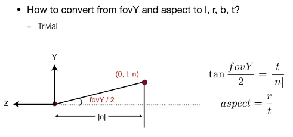

# Rasterization 1

## FOV



所有的点落在 $[-1,1]^3$ 的范围内。

## Raseterization（光栅化）

来源于德语 Raster（栅格）。

定义屏幕的左下角为原点，右上角为 $w \times h$，将屏幕分成 $w \times h$ 个像素。

像素的范围是 $[0,w-1] \times [0,h-1]$，像素中心是 $[x+0.5,y+0.5]$。

## Canonical Cube to Screen

- Irrelevant to z
- Transform in xy plane: $[-1, 1]^2$ to $[0, width] \times [0, height]$
- Viewport transform matrix (视口变换)

$$ M_{viewport} = \begin{bmatrix} \frac{width}{2} & 0 & 0 & \frac{width}{2} \\ 0 & \frac{height}{2} & 0 & \frac{height}{2} \\ 0 & 0 & 1 & 0 \\ 0 & 0 & 0 & 1 \end{bmatrix} $$

## Sampling

Defube Binary Function: inside(tri, x, y)

$$ inside(t, x, y) = \begin{cases} 1 & \text{if } (x, y) \text{ is inside } t \\ 0 & \text{otherwise} \end{cases} $$

Code:

```cpp
for (int x = 0; x < xmax; ++x) {
    for (int y = 0; y < ymax; ++y) {
        // check center of pixel
        image[x][y] = inside(triangle, x+0.5, y+0.5);
    }
}
```

- 忽略边界上的像素

- 忽略包围盒（AABB，bounding box）外的像素
