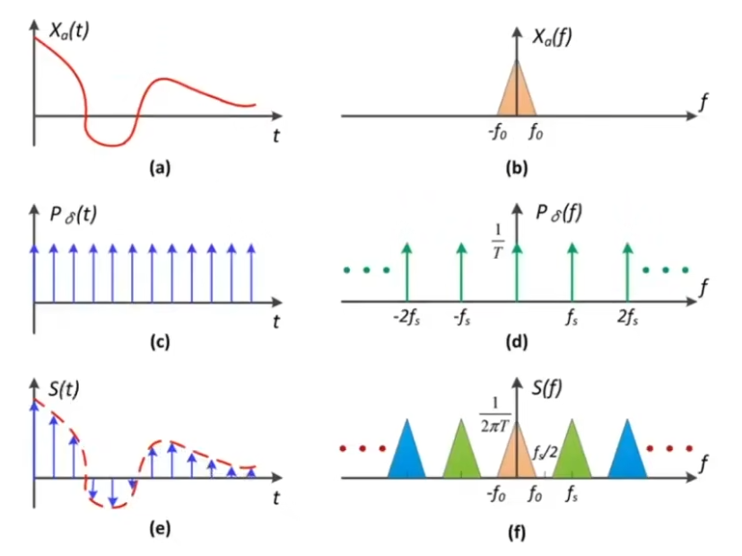

# Rasterization 2

## 三角形的光栅化

锯齿：Aliasing

瑕疵：Artifact （比如：锯齿，摩尔纹，车轮效应）

Artifacts 产生的原因：

- Signals are changing too fast (high frequency), but sampled too slowly (low sampling rate).

## 反走样：Antialiasing

先模糊，再采样

## Frequency Domain

High-frequency signal is insufficiently sampled: samples erroneously appear to be from a low-frequency signal.

Two frequencies that are indistinguishable at a given sampling rate are called "aliases".

## Filtering

High-pass filter（高通滤波）：过滤掉低频信息，显示边缘效果。

Low-pass filter（低通滤波）：过滤掉高频信息，显示模糊效果。

## 时域和频率

## Reducing Aliasing Error

### 1. Increasing the sampling rate

- Increasing the sampling rate (increasing the number of samples per unit time) is the most effective way to reduce aliasing.

### 2. Antialiasing

- Filtering out high frequencies before sampling.

Solution:

- Convolve f(x,y) by a 1-pixel box-blur
    - Recall: convolving = filtering = averaging

- Then sample at every pixel's center

### MSAA (Multi-Sample Anti-Aliasing)

#### Supersampling

通过增加采样点的数量来减少锯齿，但是会增加计算量。

其他的一些方法：

- FXAA (Fast Approximate Anti-Aliasing)
- TAA (Temporal Anti-Aliasing)
