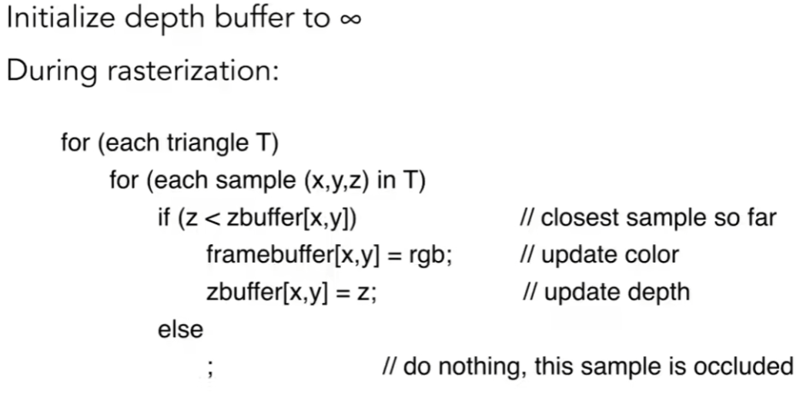
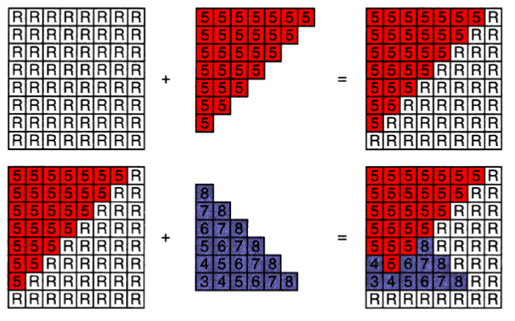
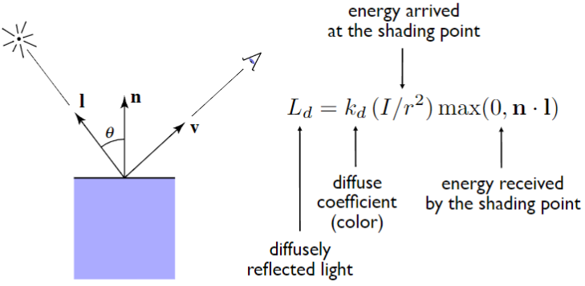

# Shading 1 (着色)

## Z-Buffer

利用深度缓冲区（Z-buffer）来实现着色。

### Z-Buffer Algorithm

遍历所有的像素，对于每个像素，计算其深度值，如果深度值小于深度缓冲区中的值，则更新深度缓冲区中的值。

**算法复杂度：O(n)**，注意这里没有进行排序，所以复杂度是O(n)。

## Shading is Local

这里忽略其他物体的影响。

## Lambertian (Diffuse) Shading

Shading **independent** of view direction.

漫反射着色**不依赖**观察方向。

$$ L_d = k_d (I/r^2 ) max(0, n · l) $$

漫反射光 = 漫反射系数 * (入射光强度 / 距离平方) * max(0, 法向量 · 入射光方向)
