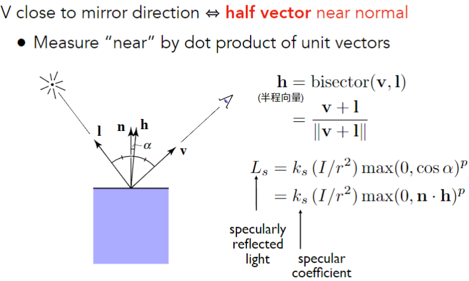
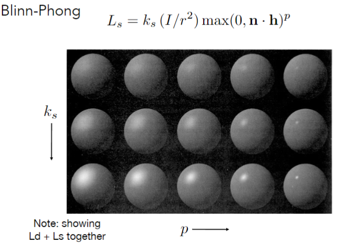
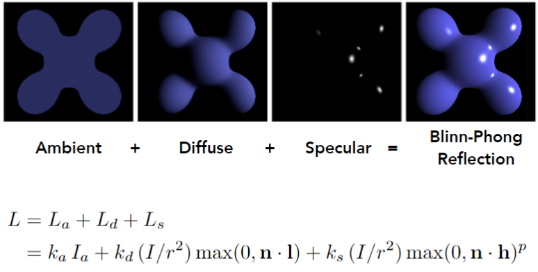
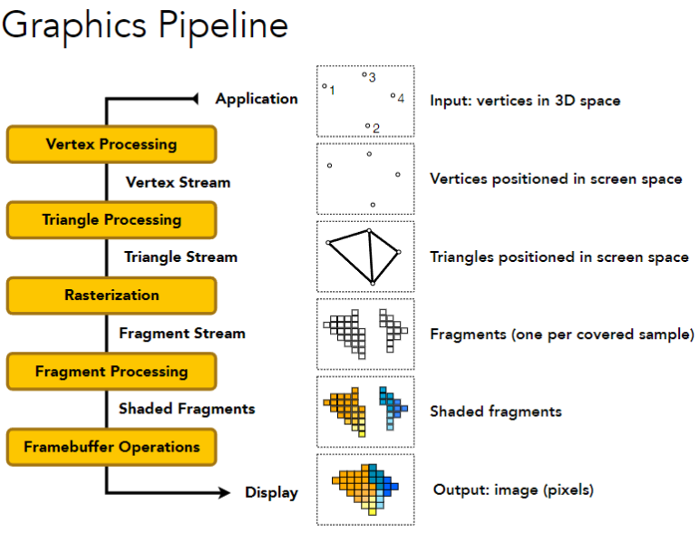
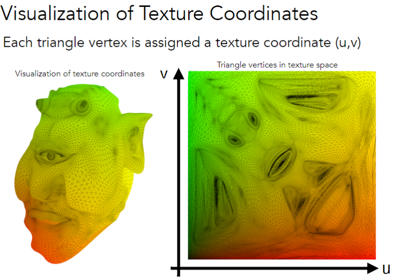
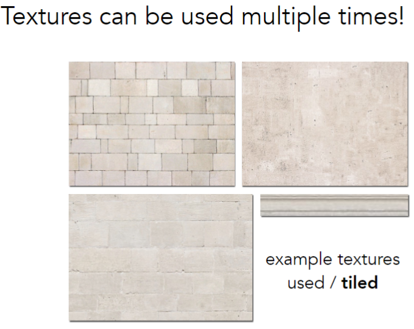

# Shading 2

## Blinn-Phong Reflection Model

### Specular Term (镜面反射, Blinn-Phong)

Intensity **depends** on view direction

镜面反射光强度**依赖**观察方向



$$
\begin{align*}
    h   &= bisector(v, l) \\
        &= \frac{v + l}{\|v + l\|}
\end{align*}
$$

$$
\begin{align*}
    L_s &= k_s (I/r^2 ) max(0, cos\alpha)^p \\
        &= k_s (I/r^2 ) max(0, n \cdot h)^p
\end{align*}
$$

这里的p是高光指数，用来控制高光的大小。



### Ambient Term (环境光)

假设环境光的强度为$ I $，环境光的反射率为$ k_a $，那么环境光的反射强度为：

$$ L_a = k_a I_a $$

### Blinn-Phong Reflection Model Summary



## Shading Frequencies

### Flat Shading

每个面都用一个颜色来表示，这种方法叫做**Flat Shading**。
效果不好，但是计算量小。

### Gouraud Shading

每个顶点都有一个颜色，然后用**线性插值**来计算中间的颜色。

### Phong Shading

对每个像素都计算一次光照，这种方法叫做**Phong Shading**。

### 法线插值

Average surrounding face normals

$$ N_v = \frac{\sum_{i} N_i}{\| \sum_{i} N_i \|} $$

## Graphics (Real-time Rendering) Pipeline



### Shader Programs

```cpp
uniform sampler2D myTexture; // program parameter
uniform vec3 lightDir; // program parameter
varying vec2 uv; // per fragment value (interp. by rasterizer)
varying vec3 norm; // per fragment value (interp. by rasterizer)

void diffuseShader() {
    vec3 kd;
    kd = texture2d(myTexture, uv); // material color from texture
    kd *= clamp(dot(–lightDir, norm), 0.0, 1.0); // Lambertian shading model
    gl_FragColor = vec4(kd, 1.0); // output fragment color
}
```

## Texture Mapping



纹理可重复应用。

tile texture：平铺纹理


