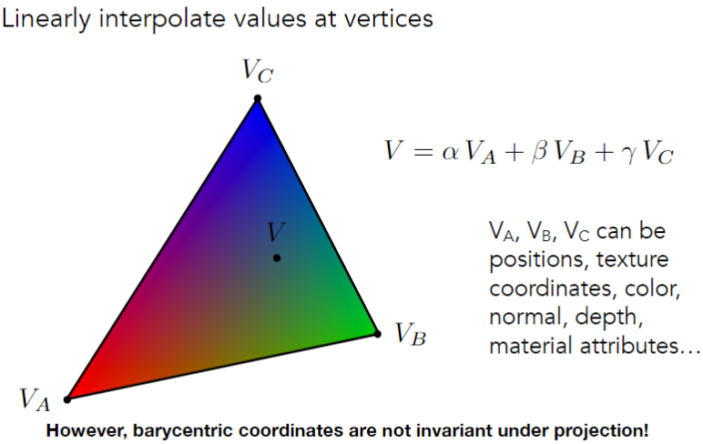

# Shading 3

## Barycentric coordinates (重心坐标)

重心坐标在投影下并不是不变的!

### Texture Magnification

#### Bilinear interpolation

$$ lerp(x, v_0, v_1) = v_0 + x(v_1 - v_0) $$
$$ u_0 = lerp(s, u_{00}, u_{10}) $$
$$ u_1 = lerp(s, u_{01}, u_{11}) $$
$$ f(s, t) = lerp(t, u_0, u_1) $$

#### Mipmapping

#### Trilinear interpolation

#### Anisotropic Filtering (各向异性过滤)

原因是，mipmap的每一层都是一个方形，但实际上，我们需要的是一个有时候长方形的mipmap更合适。

最多只会带来三倍的额外存储空间。

#### EWA Filtering

## Applications of textures

通过纹理定义相对高度（法线贴图）。

### Bump Mapping (凹凸贴图)

